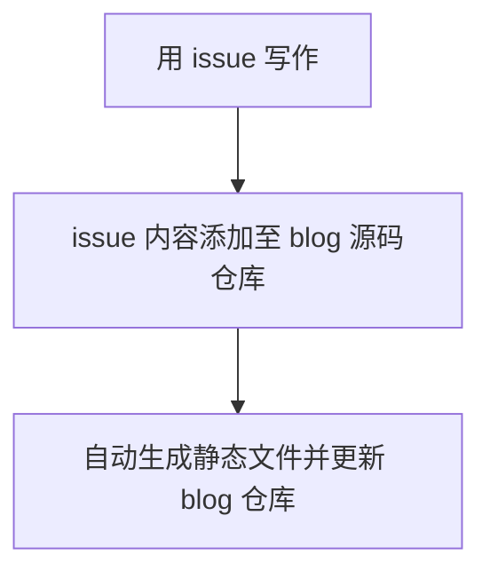

博客实现了自动部署，又纠结起写作工具。手机上喜欢用熊掌记，但是上传发布还是有些麻烦，想起很久以前看过的一篇博客文章：[使用 GitHub Issues 持续写作 | reuixiy](https://io-oi.me/tech/continuous-writing-with-github-issues/) ，又借鉴了 [yihong](https://github.com/yihong0618) 的[开源博客](https://github.com/yihong0618/gitblog)，实现了如下的博客写作、更新流程：

今后我的博客内容及相关代码都会保存在这里：[GitHub - wjianbo/blog-data](https://github.com/wjianbo/blog-data)

更多参考：[使用 Github Action 自动部署 Hugo 博客 - 知乎](https://zhuanlan.zhihu.com/p/403221054)
