午饭：米饭、炒土豆丝、鳕鱼。

鳕鱼用黑胡椒和盐腌过，煎着吃可能比烤更香。

晚饭：蛋炒饭。

买了牛排、牛肉、苹果、牛奶、干辣椒圈。

发现 VitePress。

总是想尝试新的工具。

我问 ChatGPT 这是不是一种病，它倒是一本正经地给我列出了一套写作流程。

```mermaid
flowchart TD

subgraph A[🪶 想法层 Capture]
  A1[📥 Inbox<br>零散想法、句子] --> A2[🗓 Daily Notes<br>每日记录]
  A2 --> A3[🧩 Drafts<br>潜在文章素材]
end

subgraph B[🧩 整理层 Develop]
  B1[✍️ 扩写 / 重组内容]
  B2[💡 确立主题与目的]
  B3[🪄 添加 Frontmatter<br>]
  A3 --> B1
  B1 --> B2 --> B3
end

subgraph C[🌐 发布层 Publish]
  C1[📂 VitePress docs/posts/]
  C2[⚙️ GitHub Actions<br>自动构建与部署]
  C3[🖥 GitHub / Cloudflare Pages<br>公开博客]
  B3 --> C1 --> C2 --> C3
end

subgraph D[🧘‍♂️ 心态层 Sustain]
  D1[📅 每日写 Daily Note]
  D2[🧹 每周整理 Inbox]
  D3[🚀 每月发布文章]
end

A --> B --> C
C --> D
D --> A

```

